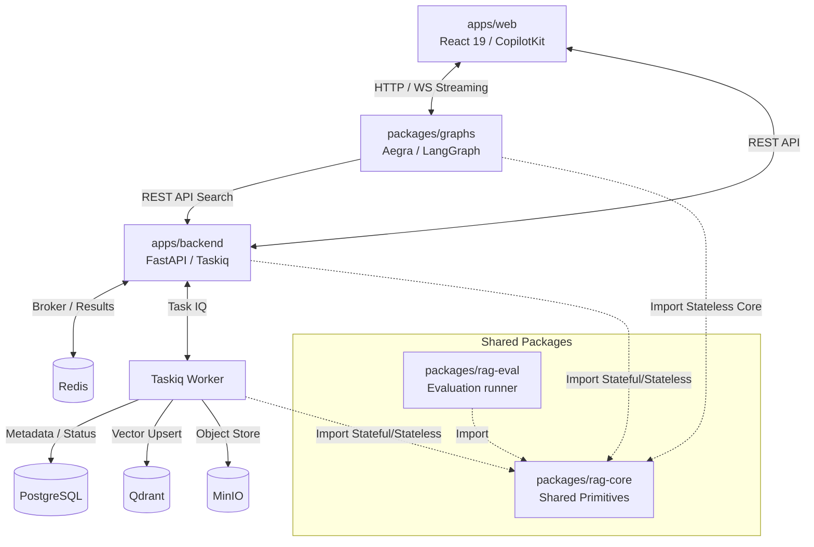

# RAG Proving Ground 시스템 아키텍처 개요 (System Architecture Overview)

본 문서는 `RAG Proving Ground` 프로젝트의 모노레포 구조 내 각 컴포넌트 간의 물리적/논리적 상호작용, 패키지 레이어 경계 규칙, 그리고 데이터 생애주기 파이프라인을 설명합니다.

---

## 1. 모노레포 구조 및 컴포넌트 역할

본 프로젝트는 `uv` 워크스페이스 기반 모노레포 구조로 관리되며, 역할에 따라 애플리케이션(`apps`)과 공유 패키지(`packages`)로 명확히 나뉩니다.

### 1.1 컴포넌트 상세 정의
*   **`apps/web`**: React 19와 CopilotKit을 탑재한 프론트엔드 웹 애플리케이션입니다. 대화형 인터페이스 및 실시간 인제스션 진행 상태 모니터링 워크벤치를 제공합니다.
*   **`apps/backend`**: FastAPI 기반 백엔드 서비스와 Taskiq 워커(Worker)입니다. 문서 업로드 접수, DB 상태 머신 제어, Qdrant 및 PostgreSQL 관리, RAG 검색 API 인터페이스 제공 등 **상태성(Stateful) 서비스**를 지휘합니다.
*   **`packages/graphs`**: Aegra 서빙 환경 위에서 구동되는 LangGraph 에이전트들의 정의 영역입니다. 의도 분류, 트리 요약 흐름, 인용 매핑 등을 직접 수행하며 LLM 응답 스트리밍을 클라이언트에게 직송합니다.
*   **`packages/rag-core`**: RAG의 기본 원시 연산(어댑터 패턴 파서, 청킹 전략, 임베딩, 벡터스토어 클라이언트 인터페이스, 쿼리 재작성, 요약기 등)이 정의된 핵심 공유 라이브러리입니다.
*   **`packages/rag-eval`**: Ragas 및 DeepEval을 연동해 RAG 파이프라인 성능을 오프라인 및 온프레미스에서 측정할 수 있는 경량 평가 러너 패키지입니다.

---

## 2. 모듈 레이어링 경계 규칙 (ADR-0008)

RAG의 다양한 전처리/후처리 컴포넌트가 난립하여 생기는 설계 혼선을 막기 위해 **데이터베이스 결합 여부**를 기준으로 철저한 계층화 규칙을 정의합니다.

> [!IMPORTANT]
> ### 규칙 1: DB 및 물리 리소스 접근의 백엔드 API 단일화 (Stateful Isolation)
> *   LangGraph 패키지(`packages/graphs`) 내부에서는 `sqlalchemy` 세션 생성기, `qdrant_client` 드라이버를 절대 직접 로드하거나 DB 커넥션을 맺을 수 없습니다.
> *   모든 지식 검색, 세션 파일 상태 조회 등 영구 저장소 조회가 필요한 로직은 백엔드의 HTTP API(예: [search_multi_knowledge_bases](file:///Users/mj/workspace/playground/rag-proving-ground/packages/graphs/src/rag_graphs/util/backend.py))를 경유해야 합니다.
> *   이를 통해 보안 크레덴셜 관리를 백엔드로 일원화하고 그래프 컨테이너의 의존성을 단순화합니다.

> [!TIP]
> ### 규칙 2: 무상태(Stateless) AI/텍스트 처리기의 인프로세스 실행 (Stateless In-Process)
> *   외부 데이터베이스 커넥션이 불필요한 연산 로직(`QueryRewriter`, `SynonymExpander`, `TreeSummarizer`, `CitationValidator`)은 `rag-core`에 순수 클래스로 설계합니다.
> *   LangGraph 노드는 이 모듈들을 직접 임포트하여 그래프 런타임 메모리 안에서 직접 실행(In-process)합니다.
> *   이를 통해 에이전트의 프롬프트 제어권을 백엔드 릴리즈 없이 그래프 영역 내에 단일 보존하고, LLM 생성 시 중간 프록시를 거치지 않는 네이티브 스트리밍 성능을 달성합니다.

---

## 3. 핵심 데이터 라이프사이클 파이프라인

### 3.1 비동기 문서 인제스션 파이프라인 (Upload-then-Process)
1.  **원시 파일 업로드 (Phase 1)**: UI에서 파일 첨부 시 `POST /file_attachments/upload` API 호출. 파일 SHA-256 해시를 추출하여 전역 파일 중복 여부를 감지하고 고유 `FileAttachment` 레코드를 생성한 뒤 MinIO 원시 버킷에 저장합니다.
2.  **세션 바인딩 및 디스패치 (Phase 2)**: `POST /sessions/{id}/files` API 호출로 대상 파일의 처리 목적(`temp_kb` 등)을 식별하고 Taskiq 비동기 워커로 작업을 전달합니다. 이 시점에 `SessionFileAttachment` 레코드 상태가 `PENDING` -> `PROCESSING`으로 전이됩니다.
3.  **비동기 인제스션 (Worker)**:
    *   **파싱**: 파서 어댑터(`docling`, `pymupdf4llm` 등)가 작동하여 `ParsedDocument` 계층형 IR 생성.
    *   **청킹**: `RAGSemanticChunker`를 거치며 Breadcrumb 메타데이터 경로 주입, Sibling Merging(파편화 방지), Fallback Splitting(임베딩 한계 대비 절단) 수행.
    *   **임베딩 & 색인**: TEI 또는 OpenAI 임베딩 모듈을 통해 벡터화하고, Qdrant 벡터스토어에 업서트합니다.
    *   **완료**: 모든 파이프라인 완료 시 PostgreSQL의 상태가 `COMPLETED`로 마킹되며, Qdrant의 해당 컬렉션이 즉시 검색 가능 상태로 준비됩니다.

### 3.2 실시간 RAG 및 대화형 파이프라인
1.  **그래프 안전 확인 (Safety Gate)**: 사용자가 질문을 송신하면 LangGraph 에이전트의 첫 번째 노드인 `safety_gate`가 가동되어, 현재 세션에 속한 파일 중 완료되지 않은 `PENDING`/`PROCESSING` 상태의 파일이 있는지 백엔드 API를 통해 조회합니다. 진행 중인 파일이 있다면 안전하게 차단 후 메시지를 송신합니다.
2.  **질의 재작성 및 확장 (Query Preprocessing)**:
    *   `QueryRewriter`가 이전 대화 기록을 참고해 대화 맥락을 보강한 검색 전용 질의를 합성하고, 필요한 경우 다중 쿼리 확장(Expansion)을 수행합니다.
    *   `SynonymExpander`가 형태소 단위의 동의어 사전 데이터베이스를 조회해 매칭되는 핵심 약어/동의어를 질의 내에 추가 주입합니다.
3.  **지식 검색 및 Reranking (Multi-KB Retrieval)**:
    *   LangGraph에서 백엔드의 검색 전용 API를 호출하면 백엔드가 지정된 다중 Qdrant 컬렉션에 대해 Dense + Sparse(ko-kiwi-bm25) 하이브리드 검색을 병렬 수행합니다.
    *   검색된 후보 청크들을 모아 Reranker(BGE-Reranker 등)에 통과시켜 최종 관련도가 가장 높은 `top_n` 개의 `RetrievedChunk`를 정밀 추출하여 그래프에 반환합니다.
4.  **답변 생성 및 인용 검증 (Synthesis & Post-processing)**:
    *   그래프는 리트리브된 청크의 원문 및 페이지 정보를 프롬프트 내에 맵 구조로 바인딩하여 LLM에 전달합니다.
    *   LLM 답변이 생성되면 `CitationValidator` 후처리기가 개입하여 LLM이 출력한 `[cite:n]` 기호들이 실제 참조로 넘겨준 원문 인덱스와 올바르게 일치하는지, 조작이나 허위 인용이 없는지 검사 및 보정합니다.
    *   최종 검증 완료된 텍스트 응답 및 참조 리소스 메타데이터 목록을 최종 클라이언트에 웹소켓 스트리밍을 통해 출력합니다.
