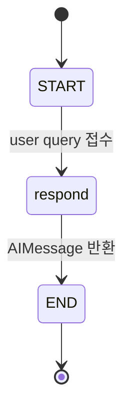

# Simple Chat 에이전트 아키텍처 (Simple Chat Agent Architecture)

본 문서는 `rag-proving-ground` 프로젝트의 대화형 에이전트인 `simple_chat` 그래프의 설계와 내부 동작 매커니즘을 정의합니다.

---

## 1. 개요 및 역할

*   **역할**: 지식 베이스 검색 연산 없이 사용자의 메시지를 기반으로 즉각적인 대화를 수행하는 기본 챗봇 에이전트입니다.
*   **용도**: RAG 지식 검색의 노이즈 없는 순수 LLM 답변 성능 검증 및 Aegra 서빙 플랫폼과의 엔드투엔드 대화 지연 시간(Latency) 측정의 기준점(Baseline)으로 기능합니다.

---

## 2. 그래프 토폴로지 (Topology)

그래프의 흐름은 하나의 실행 노드와 직선형 엣지로 구성된 단순 형태입니다.

---

## 3. 노드 상세 설명

### 3.1. `respond` (Response Generator Node)
*   **동작 역할**: 사용자의 전체 대화 기록(`MessagesState`)과 런타임 설정(`RunnableConfig`)을 수신하여 LLM 응답을 비동기적으로 생성합니다.
*   **주요 처리 시퀀스**:
    1.  **모델 검증**: `RunnableConfig` 내 `configurable` 설정에서 사용할 `model_name`을 추출합니다. 모델 허용 목록(`get_model_options()["llm_models"]`)에 해당 모델이 속해 있는지 정적으로 검증합니다.
    2.  **LLM 인스턴스 획득**: 공유 라이브러리 `rag_core` 내 [get_llm_model](file:///Users/mj/workspace/playground/rag-proving-ground/packages/rag-core/src/rag_core/ai/models.py) 팩토리 메서드를 사용해 LiteLLM 기반 챗 엔진 모델을 획득합니다.
    3.  **메시지 전처리**: 대화 이력 내에 유실되거나 호환되지 않는 타입의 메시지 객체를 정규화하기 위해 [sanitize_messages_for_llm](file:///Users/mj/workspace/playground/rag-proving-ground/packages/graphs/src/rag_graphs/util/messages.py) 전처리 훅을 가동합니다.
    4.  **비동기 LLM 호출**: `llm.ainvoke`를 통해 비동기 답변 생성을 수행합니다.
    5.  **메시지 랩핑**: LLM 결과물이 정상적인 `AIMessage`가 아닐 경우(예: 단순 문자열 등)를 대비해 안전하게 [message_content](file:///Users/mj/workspace/playground/rag-proving-ground/packages/graphs/src/rag_graphs/util/messages.py) 래퍼로 감싸서 그래프 최종 상태인 `messages` 리스트에 덧붙여 반환합니다.

---

## 4. 런타임 설정 및 상태 스키마

### 4.1. `GraphConfig` (런타임 옵션)
그래프 구동 시 `RunnableConfig`의 `configurable` 필드로 전달되는 상태 옵션 정의입니다.

| 필드명 | 타입 | 기본값 | 설명 |
|---|---|---|---|
| `model_name` | `str \| None` | `None` | 생성에 사용할 LLM 모델 식별자 (예: `"gpt-4o"`, `"claude-3-5-sonnet"`). 생략 시 LiteLLM 기본 정의 모델을 사용합니다. |

### 4.2. `MessagesState` (그래프 내부 상태)
LangGraph의 기본 메시지 상태 객체이며, `messages` 필드 내에 유저 메시지와 AI 메시지 이력이 축적됩니다.

---

## 5. 소스 코드 참조
*   에이전트 정의 진입점: [simple_chat.py](file:///Users/mj/workspace/playground/rag-proving-ground/packages/graphs/src/rag_graphs/simple_chat.py)
*   메시지 전처리 유틸리티: [util/messages.py](file:///Users/mj/workspace/playground/rag-proving-ground/packages/graphs/src/rag_graphs/util/messages.py)
