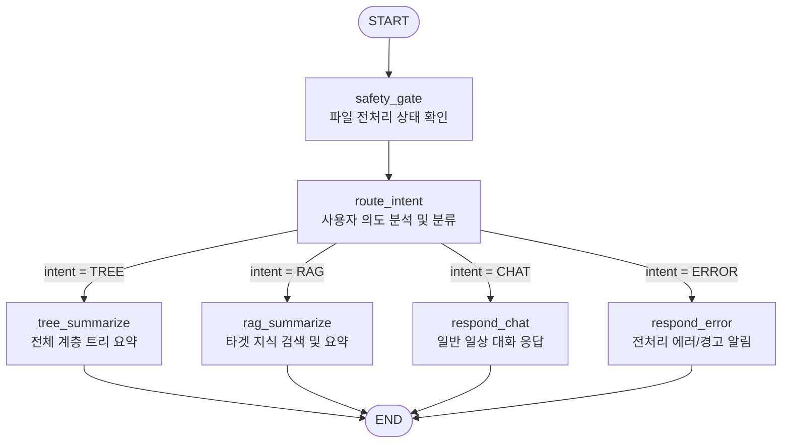

# Document Summarization Agent 아키텍처 (Document Summarization Agent Architecture)

본 문서는 `rag-proving-ground` 프로젝트에서 대화 세션 내 첨부된 문서들에 대해 고차원 계층 요약 및 질의응답을 지휘하는 `summarize_agent` 그래프의 구조와 각 컴포넌트의 상세 설계를 정의합니다.

---

## 1. 개요 및 역할

*   **역할**: 사용자가 대화 세션(`thread_id`) 내에 업로드한 단일 혹은 다중 파일에 대해, 전체 구조 요약(Tree Summary) 또는 특정 세부사항 추출 요약(RAG Targeted Summary)을 수행하는 문서 전문 분석 에이전트입니다.
*   **특징**: 비동기 파이프라인의 완료 여부를 검증하는 안전 장치(`safety_gate`)와 사용자의 의도를 정밀 분류하는 의도 분류 장치(`route_intent`)를 조합하여 자가 교정 및 지능형 라우팅 흐름을 가집니다.

---

## 2. 그래프 토폴로지 (Topology)

에이전트는 사용자의 질의 의도에 따라 동적으로 분기하여 최종 답변을 내리는 조건부 엣지(Conditional Edge) 아키텍처를 가지고 있습니다.



---

## 3. 노드 상세 설명 및 핵심 로직

### 3.1. `safety_gate` (Safety Gate Node)
*   **동작 역할**: 파일 인제스션 비동기 파이프라인이 완료될 때까지 그래프가 작동하는 것을 방지하여, 불완전한 상태에서 답변이 생성되는 레이스 컨디션을 방지합니다.
*   **핵심 처리 로직**:
    1.  **세션 첨부 파일 조회**: 백엔드 API인 [get_session_attachments](file:///Users/mj/workspace/playground/rag-proving-ground/packages/graphs/src/rag_graphs/util/backend.py)를 호출해 세션(`thread_id`)에 귀속된 파일들의 목록을 조회합니다.
    2.  **상태 검증**: 파일 중 `PENDING` 또는 `PROCESSING` 상태가 하나라도 존재하면 에러 문자열을 담아 `intent`를 `"ERROR"`로 강제 라우팅 처리합니다.
    3.  **데이터 수집**: 성공적으로 파이프라인이 완료(`COMPLETED`)된 문서들의 `doc_id`와 임시 지식베이스 식별용 `kb_id`를 그래프 상태(`doc_ids`, `kb_id`)에 기록합니다. 실패(`FAILED`)한 파일 정보가 있을 경우 이력 로그를 위해 `failed_filenames`에 파일명을 등록합니다.

### 3.2. `route_intent` (Intent Router Node)
*   **동작 역할**: 사용자 질문 문맥을 바탕으로 가장 최적의 분석 방식(TREE, RAG, CHAT)을 선정합니다.
*   **의도 분류 기준**:
    *   `TREE`: 문서 전체에 대한 요약/개요/메인 아이디어를 요구하는 경우. (예: "이 문서 요약해 줘", "Give me an overview of this PDF")
    *   `RAG`: 특정 키워드나 수치 등 부분적인 영역에 대한 필터링 및 타겟 요약을 요구하는 경우. (예: "2024년 4분기 영업이익만 요약해 줘", "What is the revenue?")
    *   `CHAT`: 문서와 관련 없는 단순 일상 대화. (예: "안녕", "반가워")
*   **처리 원리**: LiteLLM을 통해 한 번의 LLM 프롬프트 호출로 세 가지 문자열 중 하나를 판별하여 `intent` 필드에 세팅합니다.

### 3.3. `tree_summarize` (Tree Summarizer Node)
*   **동작 역할**: 문서의 특정 조각에 국한되지 않고, 전체 청크 텍스트를 고차원적으로 통계 수집하여 계층적으로 압축 요약합니다.
*   **구현 매커니즘**:
    1.  **전체 청크 다운로드**: `doc_ids` 목록에 해당하는 모든 텍스트 청크를 백엔드 API `/get_document_chunks`를 통해 병렬로 메모리에 완전히 적재합니다.
    2.  **계층 트리 요약**: `rag_core` 내 [TreeSummarizer](file:///Users/mj/workspace/playground/rag-proving-ground/packages/rag-core/src/rag_core/summarize/tree_summarize.py) 모듈을 이용해 청크들을 점진적으로 묶어가며 LLM 요약 과정을 여러 레이어로 거쳐 최상위 핵심 요약(Tree Summary)을 도출합니다.
    3.  **경고 태깅**: `failed_filenames`에 파일이 누적되어 있다면, "⚠️ 일부 파일 파싱 실패로 제외됨" 경고 라벨을 결과물 최상단에 추가합니다.

### 3.4. `rag_summarize` (RAG Summarizer Node)
*   **동작 역할**: 사용자의 구체적 질의 범위에 해당하는 문서 조각들만 선별적으로 획득하여 요약 답변을 제공합니다.
*   **구현 매커니즘**:
    1.  **임시 KB 검색**: 세션 임시 지식베이스 ID(`kb_id`)를 활용하여 백엔드 검색 API를 호출, 질의에 매칭되는 유관 청크를 획득합니다.
    2.  **타겟 요약**: [TargetedSummarizer](file:///Users/mj/workspace/playground/rag-proving-ground/packages/rag-core/src/rag_core/summarize/targeted_summarize.py) 모듈에 질문과 획득한 청크 목록을 넘겨 최적 답변을 조립합니다.
    3.  **인용 결합**: 검색에 사용된 청크 인덱스 정보를 `references` 구조 데이터로 변환해 `additional_kwargs` 필드에 바인딩하여 반환합니다.

---

## 4. 에이전트 상태 및 설정 스펙

### 4.1. `SummarizeState` (그래프 내부 상태)
LangGraph 내부 노드 간 전달되는 상태 필드 스펙입니다.

```python
class SummarizeState(MessagesState, total=False):
    intent: Literal["TREE", "RAG", "CHAT", "ERROR"]  # 결정된 분석 의도
    doc_ids: list[str]                              # 처리가 완료된 문서 UUID 목록
    kb_id: str | None                               # 세션 임시 KB UUID
    failed_filenames: list[str]                     # 인제스션 실패 파일명 목록
    error_message: str | None                       # Safety gate 에러 메시지
```

### 4.2. `SummarizeConfig` (런타임 옵션)
`configurable` 설정을 통해 주입 가능한 변수 정의입니다.

*   `model_name`: 사용할 LLM 식별 문자열.
*   `limit`: RAG 검색 시 참조할 최종 청크 개수 한도 (기본: 5).
*   `reranker_config`: 리랭커 가동 모델 설정 사양.
*   `language`: 요약 답변 시 유도할 언어 코드 (기본: `"en"`). 한국어의 경우 `"ko"`로 설정합니다.

---

## 5. 소스 코드 참조
*   에이전트 정의 및 상태 그래프: [summarize_agent.py](file:///Users/mj/workspace/playground/rag-proving-ground/packages/graphs/src/rag_graphs/summarize_agent.py)
*   트리 요약 핵심 알고리즘: [tree_summarize.py](file:///Users/mj/workspace/playground/rag-proving-ground/packages/rag-core/src/rag_core/summarize/tree_summarize.py)
*   부분 타겟 요약 알고리즘: [targeted_summarize.py](file:///Users/mj/workspace/playground/rag-proving-ground/packages/rag-core/src/rag_core/summarize/targeted_summarize.py)
