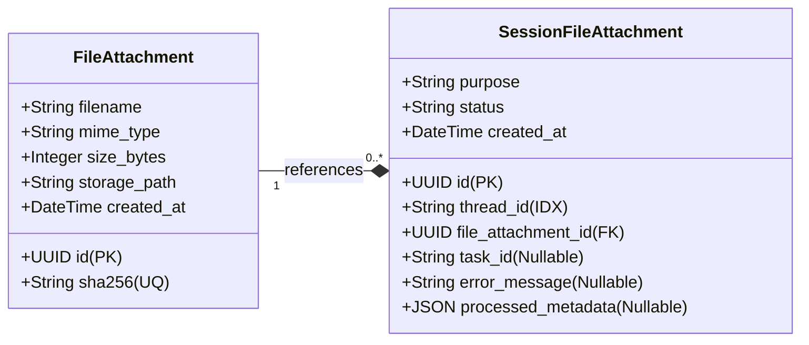

# 파일 첨부 레이어 고도화 설계서 (Extensible File Attachment Layer Design)

본 문서는 RAG Proving Ground에서 파일 첨부 레이어를 고도화하여 텍스트 문서(PDF, TXT 등)뿐만 아니라 이미지, 오디오 등 멀티모달 파일로의 확장을 대비한 아키텍처 및 분리형 처리 API 구조를 정의합니다.

---

## 1. 디자인 요구사항

1. **API 구조 분리 (Upload-then-Process)**:
   * **Phase 1 (원시 업로드)**: UI에서 파일을 첨부하자마자 원시 파일을 백엔드로 전송하고 SHA-256 해시를 기반으로 전역 중복을 확인하여 저장소에 저장합니다.
   * **Phase 2 (세션 바인딩 및 처리)**: 업로드된 파일 ID를 대화 세션(`thread_id`)에 바인딩하고, 파일 타입에 알맞은 비동기 파이프라인(텍스트 파싱, 이미지 리사이징 등)을 트리거합니다.
2. **멱등성(Idempotency) 보장**:
   * 동일한 해시의 파일이 전역 업로드될 경우 스토리지 중복 저장을 방지합니다.
   * 동일 세션 내에서 같은 파일을 반복해서 인제스션 요청할 경우, 중복 파이프라인을 실행하지 않고 기존 작업 결과를 즉시 반환(Fast-path)합니다.
3. **확장 가능한 어댑터 패턴 (Attachment Processors)**:
   * 파일의 MIME 유형 또는 목적(`purpose`)에 따라 처리 로직을 분기하는 프로세서 팩토리 구조를 설계합니다.
   * **텍스트 문서(PDF, TXT, MD 등)**: 임시 KB(Knowledge Base)로 파싱/임베딩/색인하여 RAG 검색이 가능하도록 처리합니다.
   * **멀티모달 문서(Image, Audio 등)**: 현재는 `NotImplemented` 상태의 플레이스홀더로 정의하되, 리사이징이나 오디오 변환 훅을 쉽게 구현할 수 있도록 구조만 선설계합니다.

---

## 2. 데이터베이스 및 스토리지 스키마 설계

전역 업로드된 원시 파일 정보와 개별 세션 내에서의 처리 상태를 관리하기 위해 두 개의 테이블을 정의합니다.



### 2.1. `FileAttachment` (전역 원시 파일 메타데이터)
* **`id`** (UUID, PK): 업로드된 고유 파일 참조 키.
* **`sha256`** (String, Unique Index): 파일 내용의 SHA-256 해시값. 전역 파일 중복 업로드 방지(Deduplication)를 위한 키.
* **`filename`** (String): 최초 업로드된 파일명.
* **`mime_type`** (String): 파일의 MIME Type (예: `application/pdf`, `image/png`, `audio/mpeg`).
* **`size_bytes`** (Integer): 파일 크기.
* **`storage_path`** (String): MinIO 원시 파일 저장 경로 (예: `raw-attachments/{sha256}`).

### 2.2. `SessionFileAttachment` (세션별 바인딩 및 처리 상태)
* **`id`** (UUID, PK): 세션 바인딩 고유 키.
* **`thread_id`** (String, Index): Aegra(LangGraph) 세션 ID.
* **`file_attachment_id`** (UUID, ForeignKey): `FileAttachment` 테이블 참조.
* **`purpose`** (String): 파일 활용 목적 (`"temp_kb"` | `"vision"` | `"audio"` | `"context"`).
* **`status`** (String): 처리 상태 (`"PENDING"` | `"PROCESSING"` | `"COMPLETED"` | `"FAILED"`).
* **`task_id`** (String, Nullable): Taskiq 비동기 작업 ID.
* **`error_message`** (String, Nullable): 작업 실패 시 상세 에러 로그.
* **`processed_metadata`** (JSON, Nullable): 이미지 해상도, 오디오 재생 시간, 혹은 트랜스코딩된 리소스 경로 등의 가공된 메타데이터 저장.
* *제약 조건*: `(thread_id, file_attachment_id)` 복합 유니크 제약 조건을 설정하여 하나의 세션 내 동일 파일의 다중 처리를 방지합니다.

---

## 3. 분리형 API 및 처리 시퀀스

### 3.1. Phase 1: 원시 파일 전역 업로드 (Upload)

```
[ Client ]                   [ FastAPI Backend ]                 [ Database / MinIO ]
    │                                 │                                    │
    │ 1. POST /file_attachments/upload │                                   │
    │──(File Stream)─────────────────>│                                    │
    │                                 │ 2. SHA-256 계산                    │
    │                                 │ 3. 기존 해시 존재 여부 검사         │
    │                                 │───────────────────────────────────>│
    │                                 │ <──[Exist] Return FileAttachment   │
    │                                 │                                    │
    │                                 │ 4. [NotExist] MinIO 원시 파일 저장 │
    │                                 │───────────────────────────────────>│ (attachments/{sha256})
    │                                 │ 5. [NotExist] DB FileAttachment    │
    │                                 │───────────────────────────────────>│
    │ 6. Response (FileAttachment Read)│                                    │
    │<────────────────────────────────│                                    │
```

* **엔드포인트**: `POST /api/v1/file_attachments/upload`
* **Request**: `multipart/form-data`
  * `file`: UploadFile
* **Response** (`201 Created` / `200 OK`):
  ```json
  {
    "id": "uuid-of-file-attachment",
    "sha256": "5f4dcc3b5aa765d61d8327deb882cf99...",
    "filename": "document.pdf",
    "mime_type": "application/pdf",
    "size_bytes": 1048576,
    "storage_path": "raw-attachments/5f4dcc3b5aa765d61d8327deb882cf99..."
  }
  ```

### 3.2. Phase 2: 세션 바인딩 및 비동기 처리 트리거 (Process)

```
[ Client ]                   [ FastAPI Backend ]                 [ Taskiq Worker ]
    │                                 │                                  │
    │ 1. POST /sessions/{id}/files    │                                  │
    │──{file_attachment_id, purpose}─>│                                  │
    │                                 │ 2. 세션 바인딩 멱등성 검사          │
    │                                 │    (기존 COMPLETED면 바로 리턴)    │
    │                                 │                                  │
    │                                 │ 3. 신규 Taskiq 백그라운드 작업 등록│
    │                                 │─────────────────────────────────>│
    │                                 │                                  │──┐ [Async Process]
    │                                 │                                  │  │ Document Ingest OR
    │                                 │                                  │  │ Multimodal Mocking
    │ 4. Response (SessionFileAttach) │                                  │<─┘
    │<────────────────────────────────│                                  │
```

* **엔드포인트**: `POST /api/v1/sessions/{thread_id}/files`
* **Request**:
  ```json
  {
    "file_attachment_id": "uuid-of-file-attachment",
    "purpose": "temp_kb" // "temp_kb" | "vision" | "audio" 등 (생략 시 mime_type 기반 자동 감지)
  }
  ```
* **Response** (`202 Accepted`):
  ```json
  {
    "session_file_attachment_id": "uuid-of-session-file-attachment",
    "thread_id": "aegra-thread-id",
    "file_attachment_id": "uuid-of-file-attachment",
    "purpose": "temp_kb",
    "status": "PROCESSING",
    "task_id": "uuid-of-taskiq-task"
  }
  ```

---

## 4. 확장 가능한 프로세서 어댑터 아키텍처

MIME 타입 및 `purpose`에 따른 구체적인 가공 방식은 **프로세서 어댑터 패턴**을 통해 결합도를 낮추고 모듈화합니다.

### 4.1. 클래스 인터페이스 정의 (`rag_core` 또는 `backend` 내 위치)

```python
from abc import ABC, abstractmethod
from uuid import UUID

class FileAttachmentProcessor(ABC):
    """파일 첨부 처리기 인터페이스"""
    
    @abstractmethod
    async def process(self, session_file_attachment_id: UUID, raw_file_bytes: bytes, filename: str) -> dict:
        """
        비동기 워커에서 실행되어 파일을 처리하고 결과를 메타데이터 딕셔너리로 반환합니다.
        
        Args:
            session_file_attachment_id: 세션 바인딩 고유 ID
            raw_file_bytes: MinIO로부터 읽어온 원시 바이너리
            filename: 원본 파일명
            
        Returns:
            processed_metadata: processed_metadata 필드에 적재될 구조화된 딕셔너리
        """
        pass
```

### 4.2. 어댑터 구현체 구조

#### 1) 텍스트 문서 프로세서 (`TempKbDocumentProcessor`)
* **대상**: `.pdf`, `.txt`, `.docx`, `.md` 등
* **역할**: 
  1. 해당 세션의 `temp_kb_id`를 조회하거나 없는 경우 `is_temp=True`로 동적 생성합니다.
  2. 세션-KB 매핑 정보(`SessionKnowledgeBase`)를 갱신합니다.
  3. 기존 RAG 파싱/청킹/임베딩/Qdrant 색인 파이프라인을 호출하여 해당 KB에 색인합니다.
* **반환 메타데이터**:
  ```json
  {
    "knowledge_base_id": "uuid-of-temp-kb",
    "doc_id": "uuid-of-ingested-document",
    "chunk_count": 42
  }
  ```

#### 2) 이미지 프로세서 플레이스홀더 (`ImageVisionProcessor` - 미구현 대비)
* **대상**: `.png`, `.jpg`, `.jpeg`, `.webp` 등
* **역할**: 
  * 향후 Vision LLM 처리를 위해 고해상도 이미지를 표준 규격(예: 가로/세로 최대 1024px)으로 리사이징하고 압축 처리하는 과정을 시뮬레이션합니다.
  * **현재 스펙**: 실제 동작을 수행하지 않고 `NotImplementedError`를 발생시키거나, 원본을 그냥 유지한 채 임시 성공 메타데이터만 반환하는 Mocking 방식으로 구현합니다.
* **반환 메타데이터 (Placeholder)**:
  ```json
  {
    "status": "warning",
    "message": "Image processing is not implemented yet. Raw image preserved.",
    "dimensions": {"width": null, "height": null},
    "processed_storage_path": "raw-attachments/{sha256}"
  }
  ```

#### 3) 오디오 프로세서 플레이스홀더 (`AudioTranscriptionProcessor` - 미구현 대비)
* **대상**: `.mp3`, `.wav`, `.m4a` 등
* **역할**:
  * Whisper 등의 오디오-텍스트 변환(STT) 혹은 오디오 인코딩 과정을 시뮬레이션합니다.
  * **현재 스펙**: `NotImplementedError` 혹은 플레이스홀더 성공 처리.
* **반환 메타데이터 (Placeholder)**:
  ```json
  {
    "status": "warning",
    "message": "Audio transcription is not implemented yet. Raw audio preserved.",
    "duration_seconds": null,
    "transcription_text_path": null
  }
  ```

---

## 5. UI 통합 및 상태 폴링 정책

1. **원시 업로드 즉시 수행**:
   * 사용자가 파일을 드래그하거나 선택하면 프론트엔드는 즉시 `POST /api/v1/file_attachments/upload`를 호출합니다.
   * 업로드 중에는 UI 파일 업로드 컴포넌트 내부에서 단순 네트워크 업로드 프로그레스(0%~100%)를 보여줍니다.
2. **세션 매핑 및 진행률 추적**:
   * 업로드가 완료되어 파일 고유 UUID를 획득하면 즉시 `POST /api/v1/sessions/{thread_id}/files`를 호출하여 처리를 시작합니다.
   * 반환받은 `task_id`를 기반으로 `GET /api/v1/tasks/{task_id}/status` 엔드포인트를 주기적으로 폴링(Polling)합니다.
   * `processing` 단계에서 `stage` 메타데이터(예: `PARSING` -> `EMBEDDING` -> `COMPLETED`)를 화면에 표시하여 사용자 경험을 고도화합니다.
3. **그래프 Safety Gate**:
   * 사용자가 대화창에서 엔터를 쳐서 그래프 실행(`POST /sessions/{thread_id}/runs`)을 시도할 때, Aegra 그래프의 첫 번째 노드(`safety_gate`)는 해당 세션과 연관된 `SessionFileAttachment` 중 완료되지 않은(`PENDING`, `PROCESSING`) 항목이 존재하는지 확인합니다.
   * 작업이 진행 중인 상태에서는 메시지 송신을 차단하고 "문서 분석이 완료될 때까지 기다려 주세요."라는 피드백을 전달합니다.

---

## 6. 리소스 수명 주기 및 정리 (Cleanup) 정책

1. **세션 만료 정리 (Active/Passive Clean)**:
   * 사용자가 세션 삭제 시 `DELETE /api/v1/sessions/{thread_id}/temp_kbs` (또는 통합 세션 정리 API)가 호출되면 해당 세션에 묶인 `SessionFileAttachment`와 관련 Qdrant 임시 KB 포인트를 물리 삭제합니다.
   * TTL 스케줄러가 2시간 단위로 미활성 세션의 리소스를 수집(GC)할 때 세션 바인딩 관계를 일괄 해제합니다.
2. **원시 파일 보존 및 고아 TTL 정리 (Orphaned TTL Garbage Collection)**:
   * **보존 목적**: 원본 다운로드 기능 제공, 파싱/이미지 프로세싱 설정 변경 시 재처리(Reprocessing) 보장, 동일 파일 재업로드 시 네트워크/컴퓨팅 리소스 절약(Deduplication).
   * **고아(Orphaned) 상태 정의**: 어떤 `SessionFileAttachment`나 영구 지식 베이스 문서(`KnowledgeBaseDocument`)에서도 참조되지 않는 `FileAttachment` 레코드.
   * **지연 GC(Lazy GC) 규칙**:
     * 백그라운드 스케줄러가 주기적으로(예: 매일 자정) 고아 상태인 `FileAttachment` 목록을 조회합니다.
     * 고아 상태가 된 지 **24시간(또는 설정된 유예 기간)**이 지난 `FileAttachment` 파일과 레코드를 영구 삭제합니다.
     * 물리 삭제 시 MinIO 원시 경로(`raw-attachments/{sha256}`)의 바이너리 파일과 PostgreSQL의 `FileAttachment` 레코드를 연쇄 삭제(Cascade)합니다.
