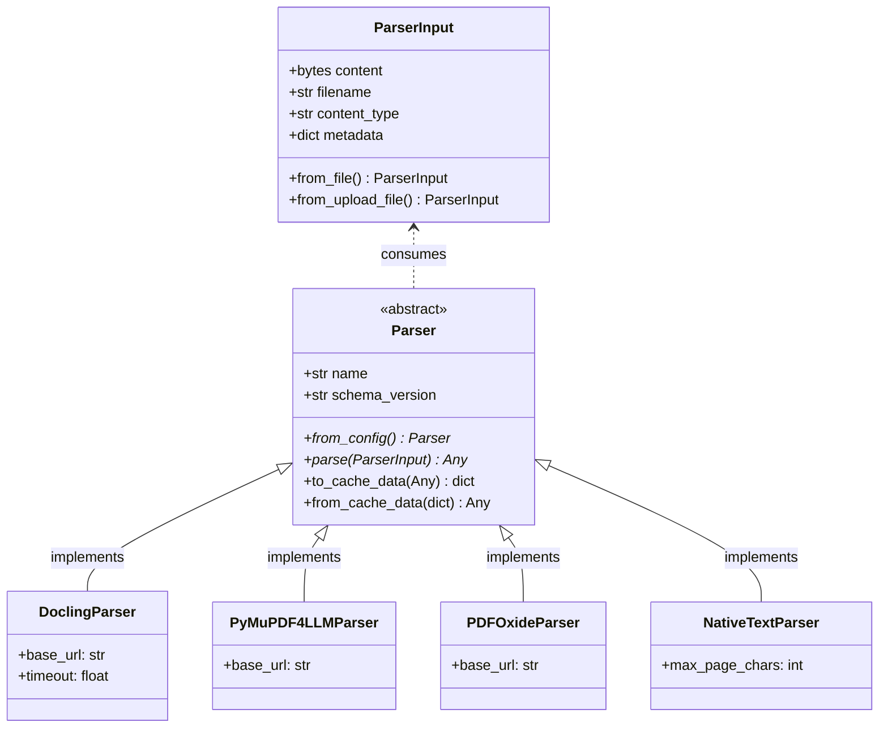

# 문서 파싱 및 계층 IR 캐싱 아키텍처 (Document Parsing & Hierarchical IR Caching)

본 문서는 `RAG Proving Ground` 프로젝트의 문서 전처리 1단계인 파싱 레이어의 모듈식 어댑터 아키텍처와 계층형 중간 표현(IR) 스키마, 그리고 해시 기반 캐싱 매커니즘을 정의합니다.

---

## 1. 파서 어댑터 인터페이스 (Parser Adapter Pattern)

다양한 물리 파서 엔진들의 결합도를 낮추고 동적으로 교체·실험할 수 있도록 `Parser` 추상 어댑터 인터페이스를 도입하였습니다.



### 1.1. 주요 컴포넌트 스펙
*   **`ParserInput`** ([interface.py](file:///Users/mj/workspace/playground/rag-proving-ground/packages/rag-core/src/rag_core/adapters/parser/interface.py#L7)): 파서에 전달될 입력 데이터 컨테이너입니다. 일반 바이너리 파일(`from_file`) 및 Starlette/FastAPI의 비동기 스트림(`from_upload_file`) 모두를 안전하게 소화하도록 팩토리 메서드를 지원합니다.
*   **`Parser`** ([interface.py](file:///Users/mj/workspace/playground/rag-proving-ground/packages/rag-core/src/rag_core/adapters/parser/interface.py#L86)): 각 파서 프로바이더의 부모가 되는 추상 베이스 인터페이스입니다. JSON 직렬화를 위한 `to_cache_data` / `from_cache_data` 등의 공통 직렬화 헬퍼 메서드가 바인딩되어 있습니다.
*   **구체적 파서 프로바이더** ([providers/](file:///Users/mj/workspace/playground/rag-proving-ground/packages/rag-core/src/rag_core/adapters/parser/providers)):
    *   `DoclingParser`: 고성능 레이아웃 및 테이블 구조 분석을 수행하는 기본 고기능 파서입니다.
    *   `PyMuPDF4LLMParser`: 빠른 속도로 PDF를 마크다운 텍스트로 전환하는 파서입니다.
    *   `PDFOxideParser`: Rust 기반의 가볍고 빠른 네이티브 텍스트 추출용 파서입니다.
    *   `NativeTextParser`: `.txt`, `.md`, `.html` 등 구조 파싱이 불필요한 기본 텍스트 파일들을 위해 동작하는 범용 파서입니다.

---

## 2. 규격화된 계층 IR 스키마 (ParsedDocument Schema)

파서가 분석한 결과물은 엔진에 구애받지 않고 일관되게 소비할 수 있도록 **`ParsedDocument`** 포맷으로 평탄화 및 정규화(Normalizing)됩니다.

*   관련 코드 스펙: [packages/rag-core/src/rag_core/parsers/schemas.py](file:///Users/mj/workspace/playground/rag-proving-ground/packages/rag-core/src/rag_core/parsers/schemas.py#L127-L186)

### 2.1. `ParsedElement` (최소 논리 의미 단위)
청킹 모듈([chunking.md](file:///Users/mj/workspace/playground/rag-proving-ground/docs/architecture/modules/chunking.md))이 직접 순회하며 조각을 내는 원천 구조입니다.
*   `element_id`: 문서 내 고유 요소 식별자.
*   `type`: `ElementType` (`heading`, `paragraph`, `table`, `image`, `list_item` 등).
*   `content`: 마크다운 또는 텍스트 형태로 규격화된 본문.
*   `logical_role`: 레이아웃 논리 역할 (`title`, `sectionHeading`, `footnote` 등).
*   `order`: 문서 내 순차 정렬 순서 (1-indexed).
*   `bbox`: 요소가 원본 PDF 상에 위치하는 물리적 영역 좌표.
*   `table_data`: `type`이 `table`일 때 채워지는 그리드 테이블 메타데이터 (`row_count`, `col_count` 및 개별 셀의 `row_span`/`col_span` 보존).

### 2.2. `ParsedDocument` (통합 문서 표준 규격)
*   `doc_id` / `filename` / `parser` (사용된 파서 엔진명).
*   `pages`: 각 페이지 메타데이터 배열.
*   `elements`: `ParsedElement` 객체들의 순차 정렬 리스트.
*   `text` / `html` / `markdown`: 문서 수준의 전체 렌더링 원문 캐시.
*   `raw`: 디버깅 및 분석 품질 리플레이를 위한 파서 엔진 고유의 로 데이터 보관 필드.

---

## 3. 해시 기반 파일 파싱 전역 캐싱 매커니즘 (`ParserCache`)

문서 파싱은 CPU/GPU 집약적인 고부하 작업입니다. 불필요한 중복 연산과 대기 시간을 차단하기 위해 **`ParserCache`** 시스템이 탑재되어 작동합니다.

*   관련 코드 스펙: [packages/rag-core/src/rag_core/adapters/parser/cache.py](file:///Users/mj/workspace/playground/rag-proving-ground/packages/rag-core/src/rag_core/adapters/parser/cache.py)

```
[ Ingest Pipeline ]
       │
       ▼ (1) 파일 업로드 수신
[ Calculate Hash ] ──────────► content_hash = SHA-256(file_bytes)
       │
       ▼ (2) 파싱 설정 해시
[ Resolve Config ] ──────────► parsing_config_hash = SHA-256(config_json)
       │
       ▼ (3) MinIO 스토리지 조회 (parser_cache/{content_hash}/{config_hash}/)
{ Check Cache Exist? }
       │
       ├─► [ YES: Cache Hit! ] ────────────────────────────────────────┐
       │     (4) result.json 다운로드                                  │
       │     (5) from_cache_data()로 역직렬화                          │
       │                                                               ▼
       └─► [ NO: Cache Miss! ]                                [ ParsedDocument 반환 ]
             (4) 실제 파서 엔진 호출 및 물리 파싱 수행                ▲
             (5) store_result()로 result.json & meta.json 업로드 ─────┘
```

### 3.1. 캐시 식별자 생성 규칙
캐시는 두 개의 해시 세션을 결합하여 물리 경로를 식별하므로 파일이 같더라도 파싱 사양이 다를 경우 오버라이트 없이 상호 공존할 수 있습니다.
1.  **`content_hash`**: 원시 바이너리 내용 고유의 16진수 SHA-256 해시값 (첫 16글자).
2.  **`parsing_config_hash`**: 실행 시 지정된 `KnowledgeParsingConfig`(파서 종류, OCR 가동 여부 등) 설정을 canonicalize하여 변환한 SHA-256 해시값.
3.  **저장 버킷 경로**: `parser_cache/{content_hash}/{parsing_config_hash}/`
    *   `result.json`: `ParsedDocument` 객체가 JSON 직렬화된 실제 결과 데이터.
    *   `meta.json`: 파싱을 수행한 파서 정보, 소요 시간(`parse_duration_sec`), 인제스션 날짜 등이 기입된 감사용 데이터.
