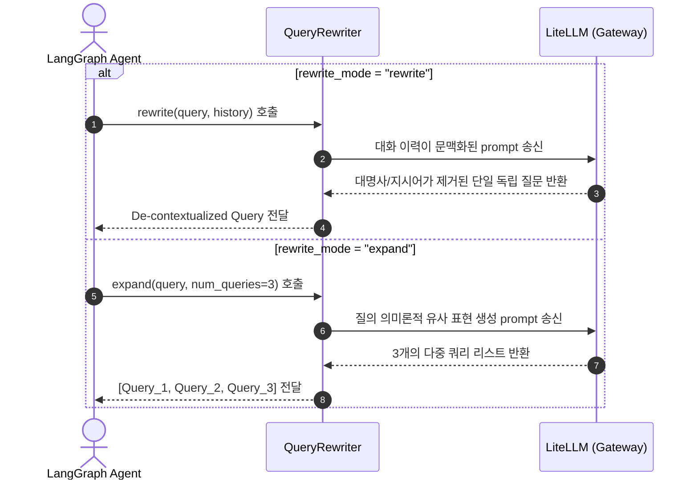

# 질의 처리 및 어휘 동의어 보강 아키텍처 (Query Processing & Synonym Expansion)

본 문서는 `RAG Proving Ground` 프로젝트의 질의 정밀도 보강을 담당하는 LLM 기반의 질의 재작성 및 어휘 형태소 기반의 동의어 사전 확장 전처리 레이어를 정의합니다.

---

## 1. 질의 재작성 및 다중 확장 (QueryRewriter)

유저의 질문은 대명사나 맥락 생략, 혹은 단어 변동성으로 인해 벡터 데이터베이스에서 직접 매칭하기에 불완전할 수 있습니다. 이를 전처리하기 위해 **`QueryRewriter`**가 동작합니다.

*   관련 코드 스펙: [packages/rag-core/src/rag_core/query_rewrite/rewriter.py](file:///Users/mj/workspace/playground/rag-proving-ground/packages/rag-core/src/rag_core/query_rewrite/rewriter.py)



### 1.1. 주요 비즈니스 메서드
*   **`rewrite(query, history)`**: 사용자가 "어제 물어본 그것의 매출은?"과 같은 대명사성 혹은 생략이 포함된 질의를 보냈을 때, 이전 대화 기록(`history`)을 결합하여 대화 문맥이 제거된 완결성 있는 단일 독립 쿼리(De-contextualized Query)로 복원시킵니다.
*   **`expand(query, num_queries)`**: 어휘적 유사성을 극대화하기 위해 원본 쿼리의 주제에 해당하는 3가지 변형 질문 리스트를 생성합니다. 이는 검색 레이어의 병렬 탐색 파이프라인([retrieval.md](file:///Users/mj/workspace/playground/rag-proving-ground/docs/architecture/modules/retrieval.md))으로 투입됩니다.

---

## 2. 조사 배제형 형태소 동의어 사전 보강 (SynonymExpander)

BM25를 주축으로 하는 Lexical Sparse 검색은 질의에 명시되지 않은 동의어/약어 검색이 불가능하다는 구조적 약점이 있습니다. 이를 해결하기 위해 형태소 매칭 방식의 **`SynonymExpander`**가 탑재되어 있습니다.

*   관련 코드 스펙: [packages/rag-core/src/rag_core/query_rewrite/synonym_expander.py](file:///Users/mj/workspace/playground/rag-proving-ground/packages/rag-core/src/rag_core/query_rewrite/synonym_expander.py)

### 2.1. 한국어 조사 오인 매칭 방지 연산 (Morpheme Tokenizer Filter)
단순한 텍스트 문자열 치환(Replace) 방식으로 동의어를 확장하면 "쿠버네티스는" 이라는 단어에서 "는"과 같은 조사에 오인 매칭이 발생하거나, 단어 사이의 경계선이 무너져 검색 노이즈가 폭증하는 치명적인 단점이 존재합니다.

```
[ Raw rewritten_query ] ──► "쿠버네티스는 무엇인가요?"
                               │
                               ▼ (1) Kiwi 한국어 형태소 분석기 구동
[ Morpheme Tokenization ] ──► [("쿠버네티스", "Noun"), ("는", "Josa"), ...]
                               │
                               ▼ (2) 명사(Noun) 등 핵심 단어 토큰만 추출 및 매핑
[ Filter Keywords ] ───────► Target = "쿠버네티스" ──► Synonym Map 매칭 실행
                               │
                               ▼ (3) 동의어 사전 데이터 조회 (쿠버네티스 = K8s)
[ Rewrite Query Text ] ────► "쿠버네티스 (K8s) 는 무엇인가요?"
```

1.  **형태소 분석**: `kiwipiepy` 형태소 분석기를 로드하여 입력 질의를 형태소(`kiwi.tokenize`) 단위로 쪼갭니다.
2.  **명사/외국어 핵심어 필터링**: 조사(`Josa`), 어미 등을 제외하고 명사(Noun, `NNG`/`NNP`)와 외국어(`SL`) 태그가 붙은 토큰만 동의어 치환 대상 키워드로 식별합니다.
3.  **동의어 합치기**: 사전 맵 데이터를 확인하여 타겟 단어에 동의어가 등록되어 있다면, 검색엔진이 Logical OR 연산에 가중치를 부여할 수 있도록 `(쿠버네티스 | K8s)` 형태로 토큰을 확장하여 쿼리 문자열에 재바인딩합니다.

---

## 3. 동의어 데이터베이스 및 동기화 흐름

동의어 데이터의 갱신과 로딩은 백엔드 API와 인메모리 맵이 다음과 같이 상호 연계됩니다.

1.  **데이터 관리**: 운영자가 UI 화면을 통해 CSV/TXT 형식의 동의어 사전 파일을 업로드하거나 웹 워크벤치에서 수정 요청하면, 백엔드 API인 `apps/backend/app/features/knowledge/synonyms/` 라우터가 이를 파싱하여 데이터베이스 테이블에 영구 저장합니다.
2.  **동적 캐시 로드**: `SynonymExpander`가 기동할 때 메모리에 캐시 맵 데이터를 초기화하며, 주기적으로 백엔드의 동의어 API를 비동기 호출하여 사전 데이터를 갱신합니다. 이를 통해 그래프가 DB 드라이버에 직접 연결되는 레이어링 위반 없이도 최신 동의어 사전 정보를 유지하여 인프로세스 연산을 수행할 수 있습니다.
