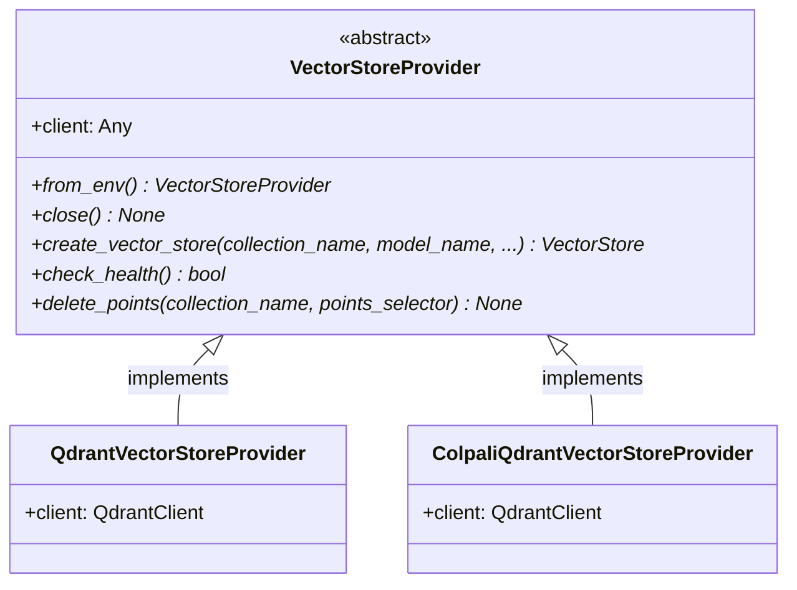
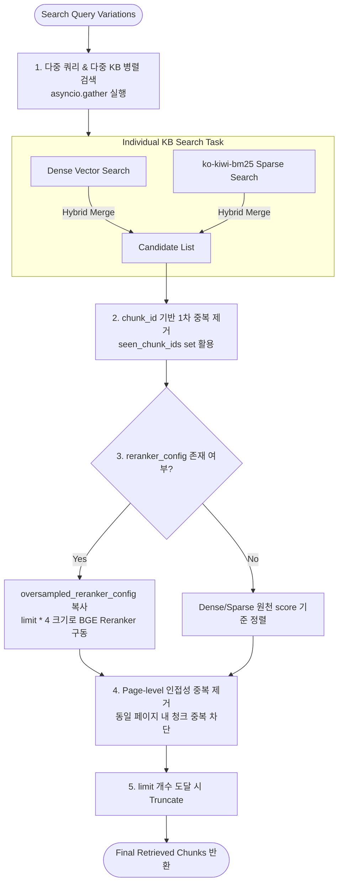

# 벡터스토어 어댑터 및 하이브리드 검색 아키텍처 (Vector Store Adapter & Hybrid Retrieval)

본 문서는 `RAG Proving Ground` 프로젝트의 핵심 탐색 레이어인 벡터스토어 어댑터 규격과 Dense + Lexical Sparse (`ko-kiwi-bm25`) 하이브리드 검색, Reranking 및 페이지 중복 제거 알고리즘 파이프라인을 정의합니다.

---

## 1. 벡터스토어 어댑터 인터페이스 (Vector Store Adapter Pattern)

다중 물리 벡터 데이터베이스 지원 및 비전 검색 확장을 위해 느슨한 결합 형태의 `VectorStoreProvider` 구조를 구현하였습니다.

*   **`VectorStoreProvider`** ([interface.py](file:///Users/mj/workspace/playground/rag-proving-ground/packages/rag-core/src/rag_core/adapters/vector_store/interface.py#L8)): LangChain의 기본 `VectorStore` 인스턴스를 추상화하여 생성하고 관리하는 부모 인터페이스입니다.
*   **`QdrantVectorStoreProvider`** ([providers/qdrant.py](file:///Users/mj/workspace/playground/rag-proving-ground/packages/rag-core/src/rag_core/adapters/vector_store/providers/qdrant.py)): Qdrant 데이터베이스를 타겟팅합니다. 임베딩 모델(Dense)과 BM25 형태소 모델(Sparse)을 결합하는 멀티 벡터 컬렉션 세팅 및 색인을 관리합니다.
*   **`ColpaliQdrantVectorStoreProvider`** ([providers/colpali_qdrant.py](file:///Users/mj/workspace/playground/rag-proving-ground/packages/rag-core/src/rag_core/adapters/vector_store/providers/colpali_qdrant.py)): ColPali 비전 RAG 모델용 특수 벡터 DB 연동 어댑터로, 페이지 이미지 매핑 및 비전 하이브리드 리트리브를 대기합니다.

---

## 2. 하이브리드 다중 검색 파이프라인 알고리즘

지식 베이스 검색 시 질의 재작성으로 도출된 다중 쿼리에 대해 병렬 하이브리드 검색을 돌린 뒤, 결과를 고정밀 정렬 및 정제하는 핵심 파이프라인 흐름입니다.

*   관련 코드 스펙: [packages/rag-core/src/rag_core/retrieval/search.py](file:///Users/mj/workspace/playground/rag-proving-ground/packages/rag-core/src/rag_core/retrieval/search.py#L49)의 `retrieve_multi_knowledge_chunks`

### 2.1. 단계별 알고리즘 세부 사양

1.  **다중 쿼리 및 다중 KB 병렬 검색**:
    *   질의 재작성을 거쳐 도출된 다중 쿼리(`queries`) 리스트와 다중 지식 베이스의 결합 경로를 순회하며 각각의 검색 비동기 코루틴 태스크(`_search_knowledge_base`)를 생성합니다.
    *   `asyncio.gather`를 통해 백엔드 데이터베이스로 병렬 쿼리를 전송해 네트워크 레이턴시 병목을 막습니다.
2.  **`chunk_id` 기반 1차 중복 제거**:
    *   병렬 쿼리 결과로 병합된 조각 중, 여러 쿼리에 동시에 걸려 들어온 동일한 `chunk_id`를 가진 중복 조각들을 필터링해 리랭커 연산 대상을 최적화합니다.
3.  **오버샘플링 리랭킹 (Oversampled Reranking)**:
    *   다중 지식베이스의 검색 점수는 물리 점수 척도가 다르므로 상호 비교가 불가능합니다. 이를 해결하기 위해 Reranker를 필수로 구동합니다.
    *   최종 응답할 개수(`limit`)보다 약 4배 넓은 후보군 범위(`limit * 4`)를 지정해 Reranker 모델에 밀어 넣는 **오버샘플링(Oversampling)** 기법을 사용하여 리랭커의 컨텍스트 압축 손실을 미연에 방지합니다.
4.  **페이지 레벨 중복 제거 (Page-level Deduplication)**:
    *   *알고리즘 배경*: 하나의 문서 페이지 내에 밀집된 여러 청크들이 검색 결과를 독차지해버리면, 생성 LLM이 참조할 수 있는 정보의 다양성(Coverage)이 심각하게 훼손됩니다.
    *   *구현 방법*: 후보 청크를 상위 순서대로 순회하며, 해당 청크가 속한 페이지 ID(`page_ids`)들을 기 설정된 `seen_pages` 세트에 추가합니다. 만약 다음 청크의 모든 소속 페이지 ID가 이미 `seen_pages` 내에 존재한다면, 그 청크는 과감히 스킵(Skip) 처리하고 다음 후보로 전이합니다.
5.  **최종 결과 Truncate**:
    *   중복 제거를 통과한 고유 페이지 기반 핵심 청크들을 `limit` 개수에 도달할 때까지 차곡차곡 채운 뒤 즉시 반환하여 답변 생성 컨텍스트의 밀도와 다양성을 보장합니다.
