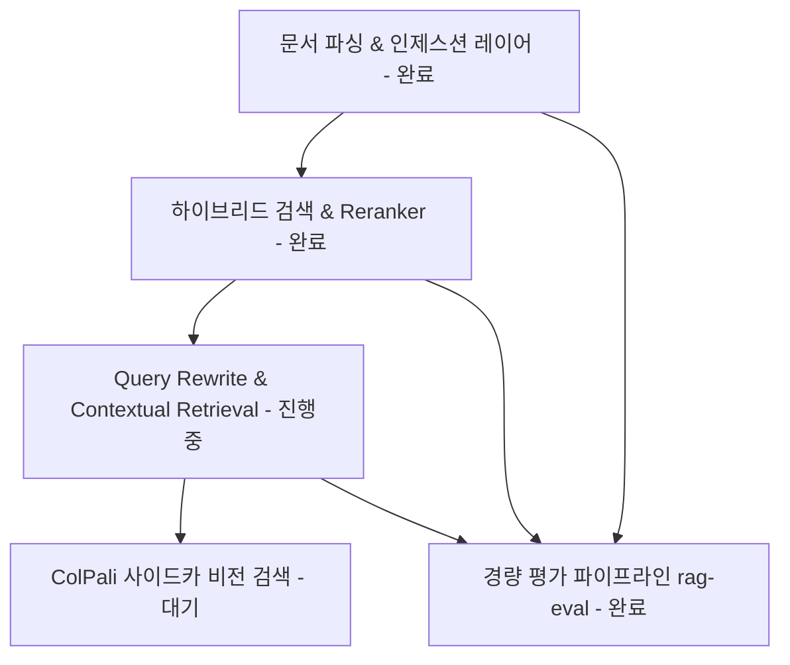

# RAG Proving Ground 프로젝트 방향성 (Project Direction)

본 문서는 `RAG Proving Ground` 프로젝트의 설계 원칙, 모듈별 개발 방향성 및 로드맵을 정의한다. 본 프로젝트는 특정 단일 RAG 제품 개발을 목표로 하기보다, RAG의 각 구성 요소를 유연하게 교체하며 성능을 검증할 수 있는 **모듈형 RAG 실험 및 서빙 스캐폴드(Scaffold)**로 기능한다.

---

## 1. 핵심 설계 원칙 (Core Principles)

- **비동기식 파이프라인 (Asynchronous Ingestion)**: 문서 파싱 및 임베딩 등 부하가 큰 인제스션 과정은 API 프로세스와 분리하고 Redis/Taskiq Worker를 통해 비동기로 처리한다.
- **모듈화 및 확장성 (Modularity & Extensibility)**: Parsing, Chunking, Embedding, Retrieval, Reranking, Generation의 각 단계를 느슨하게 결합하여 어댑터 패턴으로 손쉽게 교체 가능하도록 설계한다.
- **점진적 고도화 (Incremental Complexity)**: 안정적인 텍스트 기반 Dense Baseline을 먼저 구축한 뒤, 하이브리드 검색, ColPali 사이드카, 이미지/테이블 처리, 평가(Evaluation) 파이프라인 순서로 확장한다.

---

## 2. 시스템 아키텍처 및 기술 스택 (System Architecture & Tech Stack)

본 프로젝트는 서비스용 API/UI 서비스와 백그라운드 워커, 그리고 실험 환경을 아우르는 모듈형 아키텍처로 구성된다.

### 2.1 핵심 기술 스택
- **Backend API**: `FastAPI` (동적 라우팅 및 파이프라인 제어. 파서용 `/upload`와 대화용 `/chat` 엔드포인트 분리 제공)
- **Frontend UI**: `React 19` + `Vite` + `TypeScript` + `CopilotKit` (실제 서빙 및 인터랙티브 UI 제공. 초기 계획 문서에 언급되었던 Streamlit/Chainlit은 웹 앱 확장성과 사용자 경험 한계로 인해 React 스택으로 대체 및 변경됨)
- **LLM Gateway**: `LiteLLM` (모델 제공자 종속성을 배제하고 다중 API 엔드포인트 라우팅 및 폴백 제공)
- **Vector DB**: `Qdrant` (로컬 구동 최적화, Multi-vector 및 메타데이터 필터링/인덱싱 지원. 초기 후보였던 LanceDB는 다중 서비스 연동의 안정성을 위해 배제하고 Qdrant로 단일화)
- **Orchestration & Agentic Flow**: `LangGraph` (AutoRAG로 도출된 단위 최적 RAG 모듈을 도구(Tool)로 삼아 의도 분류, 대화 기억, 분기 루프 등을 제어하는 Multi-Agent 지휘 통제)
- **Monitoring & Observability**: `LangSmith` 및 `Langfuse` (비동기 인제스션 지연 시간 및 병목 추적, 청크 참조 흐름 시각화)

### 2.2 디렉토리 레이아웃
실제 프로젝트는 `uv` 워크스페이스 기반 모노레포 구조로 관리된다:
- `apps/backend/`: FastAPI 애플리케이션 및 Taskiq 워커
- `apps/web/`: React 19 + Vite + TypeScript 프론트엔드
- `packages/rag-core/`: 공유 라이브러리 (파서 어댑터, 청킹 전략, 임베딩, 벡터스토어 클라이언트 등)
- `packages/graphs/`: LangGraph 기반 RAG 파이프라인 정의
- `infra/`: 인프라 구성 (Postgres, Qdrant, Redis, Ollama, TEI 등 도커 컴포즈 프로파일)
- `experiments/`: Ragas/AutoRAG 기반 오프라인 성능 벤치마크 및 실험용 노트북

---

## 3. RAG 파이프라인 모듈별 방향성 & 실행 태스크

### 3.1 문서 파싱 (Parsing)
* **기본 설계**: `Docling`을 기본 Baseline 파서로 삼되, 다양한 문서 포맷(PDF, Web, 마크다운)과 복잡한 레이아웃 대응을 위해 확장 가능한 플러그인 어댑터 구조를 확보한다.
* **현재 상태 및 완료 사항**:
  * **파서 인터페이스 레이어 중립화 완료**: `rag_core/adapters/parser` 아래에 어댑터 패턴 및 레지스트리 구조를 확립하였으며, `Docling`, `PyMuPDF4LLM`, `PDFOxide`, `Native Text` 등 다양한 파서를 동적으로 생성 및 스위칭하여 호출할 수 있도록 개선 완료.
  * **중첩 구조(Nested Elements) 및 다중 바운딩 박스(Multi-BBox) 지원**: 파서가 추출한 DOM 구조 및 bounding box, `provenance` 정보들을 유실 없이 묶어서 관리할 수 있도록 `ParsedDocument` IR 및 데이터 스키마 수정 완료.
* **구체적 실행 태스크 (Next Actions)**:
  * **웹 및 특수 파서 추가**: 웹 페이지 및 동적 콘텐츠 파싱을 위한 `Firecrawl` 어댑터 구현 및 테이블/이단 배치 문서 고도화를 위한 `LlamaParse` 검토 및 통합.

### 3.2 청킹 (Chunking)
* **기본 설계**: 단순 글자 수 기반 분할을 지양하고, 파서의 구조 분석 결과를 최대한 활용하는 **Semantic-First** 청킹을 수행한다.
* **현재 상태 및 완료 사항**:
  * Heading 구조를 활용한 상위 문맥 전달(Breadcrumb) 주입 완료.
  * 글머리 기호 및 각주 등 잘게 쪼개지기 쉬운 조각을 하나로 묶는 Sibling Merging 구현 완료.
  * 임베딩 모델의 한계 토큰을 초과하지 않도록 단락/문서 단위로 방어적으로 분할하는 `RAGFallbackTextSplitter` 구현 완료.
* **구체적 실행 태스크 (Next Actions)**:
  * **Breadcrumb 노이즈 제거**: 번호성 prefix(`제1장`, `1.`, `제2조` 등)를 정규식 등으로 압축 정리하여 토큰 낭비 방지.
  * **테이블/이미지 복잡도 판별기(Classifier) 도입**:
    * 단순한 표는 파싱 텍스트(HTML/Markdown/JSON) 형태로 변환해 처리(`FT-RAG` 접근법).
    * 복잡한 표/차트는 비전 렌더링 이미지 검색으로 라우팅할 수 있는 복잡도 분류 판별 로직 및 작은 아이콘/데코용 이미지 필터링 로직 구현.
  * **테이블/이미지 캡션 추출 및 바인딩**: 표/이미지 주변의 문맥을 캡션 정보로 추출해 해당 요소의 메타데이터에 포함시키는 결합 구조 설계.
  * **Advanced Chunking 연구**: Agentic Chunking(LLM 기반 적응형 분할) 및 Proposition-based Chunking(명제 단위 분할) 도입 검토.

### 3.3 임베딩 및 검색 (Embedding & Retrieval)
* **기본 설계**: `Dense + Lexical Sparse (BM25)` 하이브리드 검색을 기본으로 삼고, 검색 품질 조율을 위해 Reranker 단계를 결합한다. 인제스션 시 다중 메타데이터를 강제 태깅하여 정교한 하이브리드 검색 필터링을 지원한다.
* **현재 상태 및 완료 사항**:
  * **Kiwipiepy 형태소 분석기 기반 한국어 BM25 연동 완료**: 한국어 고유 명사와 조사를 정밀하게 발라내기 위해 Kiwi 형태소 분석기를 내장한 `ko-kiwi-bm25` sparse embedding 모듈을 구현하여 Qdrant의 sparse vector 인덱스와 성공적으로 연동 완료.
  * **하이브리드 검색(Hybrid Search) & Reranker 통합 완료**: Dense 검색과 Sparse 검색 결과를 결합하고, LiteLLM Reranker(또는 외부 Reranker)를 통과시켜 검색 점수를 재계산하는 하이브리드 검색 파이프라인 완성.
* **구체적 실행 태스크 (Next Actions)**:
  * **언어별 처리 전략 패턴화 (Language Strategy Pattern)**: `synonym_expander`의 정규식 바운더리 체크, 한글 토큰 수 계산 및 형태소 분석기 연동 등, 코드베이스 전반에 산재해 있는 한국어 분기 처리 및 언어별 별도 로직을 전략 패턴(Strategy Pattern)으로 구조화하여 다국어 확장성 확보.
  * **다중 표현 인덱싱 (Summary + Raw Text)**: 전체 문서/섹션 요약본 벡터로 1차 검색을 수행하고, 생성 모델 입력에는 캡슐화된 원문(Raw Text)을 전달하는 다중 표현(Parent-Child) 매핑 구조 구현.
  * **메타데이터 필터링 최적화**: 인제스션 시 생성일(`timestamp`), 문서 버전, 카테고리 등 메타데이터를 필수 태깅하도록 보완하고 필터링 쿼리에 적극 활용.

### 3.4 검색 보조 및 다중 모달리티 (Retrieval Support & Vision)
* **기본 설계**: ColPali(Vision RAG) 모델을 메인 검색으로 전체 적용하면 서빙 비용과 LLM 컨텍스트 비용이 폭증하므로, 특정 조건에서만 켜는 **사이드카(Sidecar) 검색 보조** 방식으로 사용한다.
* **현재 상태 및 완료 사항**:
  * ColPali를 활용하여 Qdrant에 인덱싱 및 로드하는 `colpali_qdrant.py` 어댑터가 구현되어 있어 실증 가능.
* **구체적 실행 태스크 (Next Actions)**:
  * **ColPali 사이드카 하이브리드 쿼리 설계**:
    1. ColPali를 사용해 질의와 매칭되는 가장 연관된 페이지(Page Image) 후보군을 우선 검색.
    2. 생성용 LLM 입력 시에는 이미지 전체 대신 해당 페이지에 대응하는 정규화된 파서 텍스트(Parsed Text/Page Content)를 전달해 토큰 비용 최소화.
    3. 필요할 경우 이미지/표 스크린샷 링크를 레퍼런스 메타데이터 형태로만 추가 제공.

### 3.5 쿼리 재작성 (Query Rewrite)
* **기본 설계**: BM25의 동의어/약어 검색 한계를 극복하기 위해 Query Rewrite 단계를 도입한다.
* **현재 상태 및 완료 사항**:
  * **Query Rewrite 모듈화 완료**: `rag_core/query_rewrite/rewriter.py`에 LiteLLM을 활용한 질의 재작성 및 확장(Conversational Rewrite / Query Expansion) 기능을 모듈화하고, 동의어/약어 사전 관리를 수행하는 `SynonymExpander` 모듈을 구현하여 `simple_rag.py` 등 실제 검색 전처리 흐름에 연동 완료.
* **구체적 실행 태스크 (Next Actions)**:
  * **동의어 사전 데이터베이스 고도화**: 대형 사전 파일 또는 동적으로 편집 가능한 데이터베이스 연동 및 도메인 전문 용어(Domain Term) 확장 메커니즘 고도화.

### 3.6 요약 및 컨텍스트 보강 (Contextual Retrieval & Summarize)
* **기본 설계**: 각 청크마다 전체 문서의 맥락을 LLM으로 생성해 덧붙이는 전통적인 Contextual Retrieval은 비용이 너무 크므로, **비용 효율적인 요약본 연동 변형 전략**을 취한다.
* **현재 상태 및 완료 사항**:
  * **트리 요약 및 타겟 요약 모듈 구현 완료**: `rag_core/summarize` 아래에 LlamaIndex 기법을 활용하여 긴 문서를 점진적으로 축약해 가며 전체 요약본을 생성하는 `TreeSummarizer`와 질문 및 청크를 조합하여 특정 요약을 수행하는 `TargetedSummarizer` 구현 완료. `summarize_agent.py`에서 실시간 서빙 중.
* **구체적 실행 태스크 (Next Actions)**:
  * **저비용 Contextual Retrieval 파이프라인 구현**:
    1. 인제스션 시점에 문서 전체 요약을 1회 생성하여 캐싱.
    2. 색인 시 각 청크 텍스트에 전체 문서 요약(및 페이지 요약) 내용을 결합한 `enrichment` 텍스트 필드를 생성하여 함께 벡터 DB에 등록하거나 메타데이터로 보관하여 검색 정확도 상향.

### 3.7 프롬프트, 인용 및 가드레일 (Prompt, Citation, Guardrails)
* **기본 설계**: 프롬프트 관리 및 인용(Citation) 기능은 일차적으로 LangGraph 내부의 프롬프트 엔지니어링으로 처리하며, 가드레일(Guardrails)은 실험 단계에서는 복잡도를 낮추기 위해 제외한다.
* **현재 상태 및 완료 사항**:
  * **인용 후처리 검증 완료**: LLM이 답변에서 사용한 `[cite:n]` 인용 번호가 실제 전달된 Reference 문서 범위 내에 정확히 매칭 및 존재하는지 후처리 검증하는 `CitationValidator` 모듈 구현 완료.
  * **실행 안정을 위한 Safety Gate 구현 완료**: 비동기 문서 인제스션이 끝나지 않은 상황(`PENDING`/`PROCESSING` 상태)에서 그래프 실행을 시도할 경우, 이를 감지하고 안전하게 실행을 일시 블로킹하는 `safety_gate` 노드 구현 완료.
* **구체적 실행 태스크 (Next Actions)**:
  * **Prompt Registry 구축**: Graph 내부에 흩어진 프롬프트 템플릿을 통합 관리 및 버전 관리(Versioning)할 수 있는 Registry 모듈 분리.
  * **프롬프트 최적화 실험**: 평가 체계가 완비된 후, 유전 알고리즘 또는 프롬프트 자동 튜닝 기법을 적용할 수 있는 구조 실험(장기 과제).

---

## 4. 평가 및 실험 전략 (Evaluation)

* **기본 방향**: 거대하고 무거운 AutoRAG 프레임워크는 프로덕션 런타임/서빙 파이프라인에서 배제하고, **Ragas**와 **경량 자체 평가 러너(Evaluation Runner)**의 조합으로 빠른 피드백 루프를 구축한다. 단, AutoRAG는 `experiments/` 내의 오프라인 모듈 벤치마크 및 탐색 목적으로만 한정하여 활용한다.
* **현재 상태 및 완료 사항**:
  * **Ragas 및 DeepEval 통합 평가 프레임워크 구축 완료**: `packages/rag-eval` 패키지 하위에 `deepeval_evaluator.py`, `ragas_evaluator.py`, `runner.py`를 구현하여 RAGAS 및 DeepEval의 성능 메트릭(Context Recall, Precision, Faithfulness, Answer Relevance 등)을 일괄적으로 기록 및 벤치마크할 수 있는 평가 런타임 수립.
* **구체적 실행 태스크 (Next Actions)**:
  * **자체 테스트셋 구성 고도화**:
    * 단순 공개 데이터셋 대신 프로젝트에서 실제 타겟으로 삼는 문서 유형(PDF, HTML, 정형 보고서, 표/이미지가 많은 문서 등)으로 50~100개 내외의 한국어/영어 자체 평가 데이터셋 구성 및 정기 자동 평가 파이프라인 연동.

---

## 5. 로드맵 및 백로그 (Roadmap & Backlog)

본 백로그는 핵심 RAG 아키텍처 구축과 고급 에이전틱/멀티모달 확장 연구 과제를 포함하는 통합 로드맵이다. 각 항목의 주요 개념과 실행 목표가 설명과 함께 기술되어 있다.

### 5.1 문서 파싱 및 청킹 (Parsing & Chunking)
- **테이블/이미지 전처리 및 복잡도 판별 (FT-RAG)**: 표는 YAML/JSON 구조 데이터로 변환(`FT-RAG`)하고, 무의미한 이미지는 필터링하며 복잡한 구조는 비전 모델이나 사이드카로 라우팅하는 판별 로직 구현.
- **웹 및 특수 파서 어댑터 확장**: 웹 크롤링/동적 컨텐츠를 위한 `Firecrawl` 및 복잡한 구조 문서 파싱을 위한 `LlamaParse` 어댑터 플러그인 구현.

### 5.2 임베딩 및 검색 (Embedding & Hybrid Search)
- **언어별 처리 전략 패턴화 (Language Strategy Pattern)**: `synonym_expander`의 정규식 바운더리 체크, `tree_summarize`의 한글 토큰 수 계산 및 분석기 연동 등, 코드베이스 전반에 산재한 한국어 분기 처리 및 언어별 별도 로직을 전략 패턴(Strategy Pattern)으로 구조화하여 다국어 지원이 용이하도록 고도화.
- **다중 표현 인덱싱 (Summary + Raw Text)**: 전체 문서/섹션 요약본 벡터로 검색을 수행하고, 실제 생성 모델 입력에는 캡슐화된 원문(Raw Text)을 전달하는 다중 표현(Parent-Child) 매핑 구조 구현.
- **메타데이터 강제 태깅 체계 구축**: 인제스션 시 생성일(`timestamp`), 문서 버전, 카테고리 등의 메타데이터 필드를 강제 부여하고, 검색 쿼리에서 최신 문서 가중치 부여 및 필터링 필드로 활용.

### 5.3 생성, 요약 및 프롬프트 (Generation, Summarization & Prompt)
- **저비용 Contextual Retrieval**: 문서 전체 요약을 인제스션 시점에 1회 생성하여 캐싱해 두고, 개별 청크에 메타데이터 혹은 `enrichment` 필드로 붙여 검색 매칭율을 높이는 저비용 컨텍스트 보강 기법.
- **Prompt Registry**: 분산된 프롬프트 템플릿을 통합 관리하고 버전 관리를 용이하게 하기 위한 프롬프트 레지스트리 모듈 분리.

### 5.4 에이전틱 흐름 및 가드레일 (Agentic RAG & Guardrails - 확장 연구)
- **유전 알고리즘 기반 프롬프트 진화 (Prompt Evolution)**: Ragas 점수가 가장 높게 나오는 최적의 프롬프트 지시문 조합을 유전 알고리즘(선택, 교차, 변이)을 통해 LLM이 스스로 찾아내는 프롬프트 튜닝 기법.
- **컴파일 기반 프롬프트 최적화 (`DSPy`)**: 프롬프트를 텍스트가 아닌 코드로 취급하여, 소량의 학습 데이터셋으로 프롬프트와 Few-shot 예시를 자동 튜닝하고 최적화하여 컴파일하는 프레임워크 도입.
- **장기 기억 레이어 (`Mem0` / `Zep`)**: 대화 히스토리 조회를 넘어 유저의 개인화된 선호도, 과거 사실 등을 비동기 추출하여 장기 프로필 DB에 누적하고 RAG 컨텍스트에 주입하는 기술.
- **Context Compression (`LLMLingua`)**: 정보 이론을 기반으로 검색된 청크의 토큰 중요도를 계산하여, 핵심 의미를 보존하면서 컨텍스트 크기를 대폭 압축해 비용과 지연 시간을 최적화하는 기법.
- **Self-RAG / Corrective RAG (CRAG)**: 검색 결과의 품질과 유관성을 LLM이 스스로 판별(Self-Critique)하고, 신뢰도가 낮을 경우 웹 검색(Firecrawl, Tavily)을 동적으로 호출하여 보완하는 자가 교정 워크플로우.
- **Intent Routing & Tool Use**: 사용자의 대화 의도를 분류하여 내부 벡터 DB 검색, 웹 크롤링, 백엔드 함수(파이썬 툴) 실행 등으로 동적 라우팅하는 Multi-Agent RAG 구조.

### 5.5 다중 모달리티 및 차세대 검색 (Multimodal & Next-Gen Retrieval - 확장 연구)
- **ColPali 사이드카 하이브리드 비전 검색**: 질의와 매칭되는 페이지 이미지를 ColPali로 먼저 검색하고, 실제 LLM 답변 생성 시에는 정규화된 텍스트 컨텐트만 매핑하여 토큰 비용과 서빙 리소스를 최적화하는 하이브리드 비전 RAG.
- **Embed-less / Chunk-less RAG (Native Long-Context)**: 대규모 컨텍스트 윈도우(Gemini 1.5 Pro 등)의 특성을 활용해 파싱/청킹 없이 원본을 통째로 컨텍스트에 밀어 넣어 답변을 생성하는 비용/레이턴시 한계점 탐색 실험.

### 5.6 평가 및 검증 (Evaluation & Validation)
- **자체 테스트셋 구축**: PDF, HTML, 정형 보고서 등 프로젝트 타겟에 맞춘 자체 테스트셋 50~100개 구성.

---

## 6. 문서 관리 및 의사결정 기록 (Document Governance & ADR)

* **종합 방향성 문서 (`project_direction.md`)**:
  * 이 문서는 항상 프로젝트의 최신 설계와 로드맵을 반영하는 **Living Document**로 관리한다.
  * 새로운 마일스톤이 도달하거나 설계가 업데이트될 때마다 이 문서의 텍스트와 5번 섹션의 백로그 상태를 갱신한다.
* **아키텍처 결정 기록 (ADR: Architecture Decision Record)**:
  * 프로젝트 진행 중 특정 아키텍처 결정이나 설계 변경, 그리고 그에 따른 **고민의 과정 및 선택 근거**는 이 문서에 계속 이어 쓰지 않고 별도의 기록으로 격리하여 저장한다.
  * `docs/adr/` 폴더 내에 마크다운 문서 형식으로 아카이빙한다.
  * **ADR 문서 명명 규칙**: `docs/adr/{NUM}-{slug}.md` (예: `docs/adr/0001-neural-sparse-exclusion.md`, `docs/adr/0002-colpali-sidecar-hybrid.md`)
  * 이를 통해 종합 문서는 항상 정돈된 '최신 설계서' 지위를 유지하고, 히스토리는 ADR을 통해 추적성을 보장한다.
